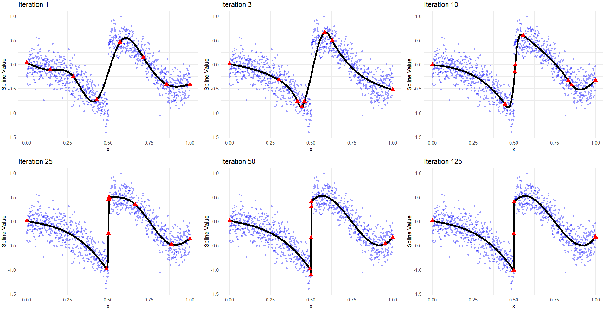
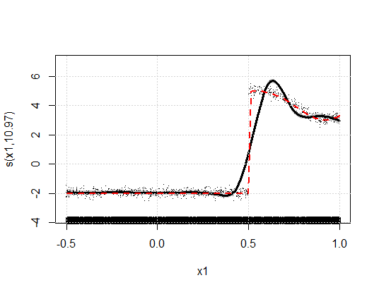
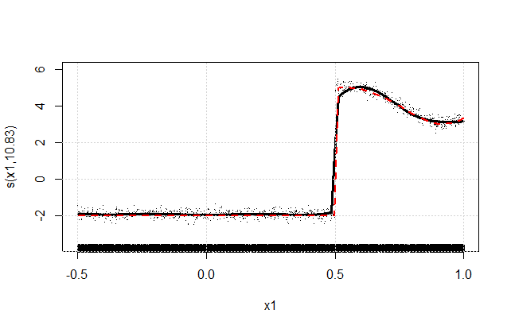
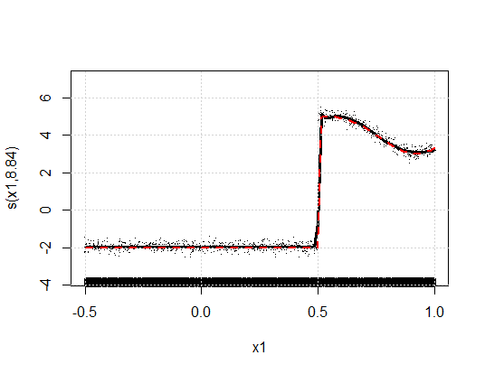
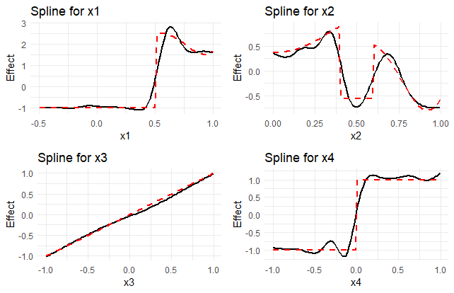
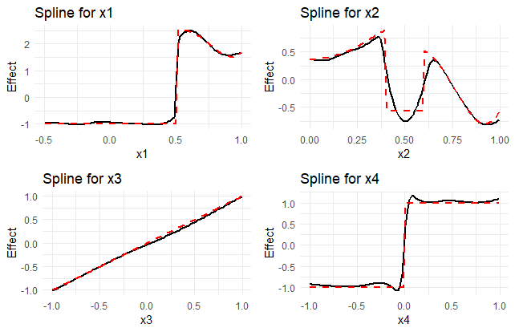
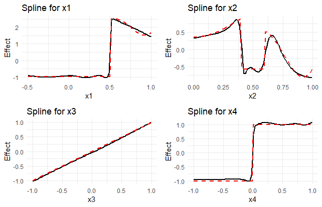
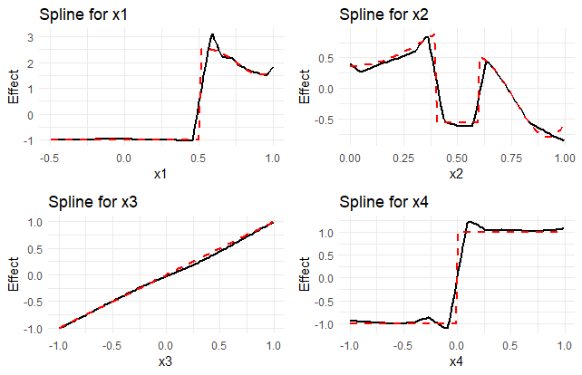
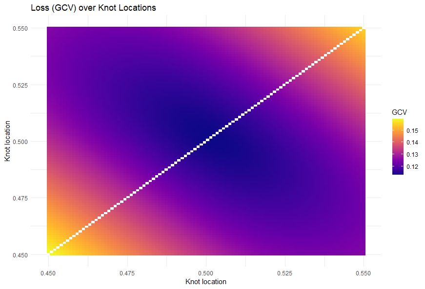

<div align="center">

</div>

# Enhancing Adaptive Spline Regression

## Overview

This repository contains R code for the paper:

**Enhancing Adaptive Spline Regression: An Evolutionary Approach to Optimal Knot Placement and Smoothing Parameter Selection**


In this repository, we address the challenge of finding the optimal adaptive spline for given input data as a hyperparameter optimization problem. Specifically, we aim to optimally determine the set of knots (𝜅) and the smoothing parameters (𝜆). We focus on minimizing well-known criteria such as Generalized Cross-Validation (GCV) and Restricted Maximum Likelihood (REML), which are traditionally used in Generalized Additive Models (GAMs). To achieve this, we leverage Particle Swarm Optimization (PSO), a robust evolutionary algorithm that efficiently navigates the complex parameter space, avoiding local minima that can trap gradient-based methods. This approach is particularly effective for non-linear optimization problems, making it well-suited for the task of optimal knot placement and smoothing parameter selection.

In the optimization process, knots are optimized as demonstrated in the figure below. The red dots represent the knot locations and the black line, the fit of the spline dependent on the given locations.

<div align="center">

</div>

## Comparison to default and other optimization methods
Below is a simple data generating function with a sharp jump. All models are fit with the same number of knots and the same smoothing parameter optimization criterion, GCV. "Equidistant" represents the default fit from a gam within the mgcv package. Gradient represents a numerical differentiation approach, a learning rate of 0.01, constant learning rate decay with a factor of 0.9 after 50 epochs and early stopping with a large patience of 50, since the best parameters (knot location and smoothing parameter) are returned.
Nelder-Mead represents optimization of GCV with respect to knot locations and smoothing parameters over 20.000 iterations (until convergence). OK-PSO describes the presented methods optimization over 100 iterations. The red line denotes the true data generating process. 


<table>
  <tr>
    <th>Equidistant</th>
    <th>Gradient</th>
    <th>Nelder-Mead</th>
    <th>OK-PSO</th>
  </tr>
  <tr>
    <td></td>
    <td></td>
    <td></td>
    <td></td>
  </tr>
</table>

While for univariate examples, all optimization algorithms perform similarly, for multivariate examples, the presented method outperforms, especially gradient based optimization:

<table>
  <tr>
    <th>Equidistant</th>
    <th>Gradient</th>
    <th>Nelder-Mead</th>
    <th>OK-PSO</th>
  </tr>
  <tr>
    <td></td>
    <td></td>
    <td></td>
    <td></td>
  </tr>
</table>


Since gradient based optimziation cannot merge and unmerge knots, we did not allow knot merging, but implemented a boundary for how far the knots have to be apart, 1e-08. Interestingely, implementing the same strategy for Nelder-Mead and PSO results in the following results:


<table>
  <tr>
    <th>Nelder-Mead</th>
    <th>OK-PSO</th>
  </tr>
  <tr>
    <td></td>
    <td></td>
  </tr>
</table>


<div style="display: flex; align-items: center;">
    <p style="flex: 1; margin-right: 20px;">The reasons for gradient-based methods performing comparably poorly are that GCV and REML tend to have local minima, which can lead to gradient-based methods getting stuck in these. PSO, on the other hand, is quite good at escaping these minima. GCV of a univariate model with a fixed smoothing parameter shows this for the position of only the two center knots.</p>
    
</div>


## Repository Structure

- **data_simulation/simulate_data.R**: Contains functions for generating simulated data.
- **module/ok_gam.R**: Contains functions for fitting Generalized Additive Models (GAM) using Particle Swarm Optimization (PSO), gradient based optimization and Nelder-Mead using the optim package.
- **module/replace_close_points.R**: Contains helper functions to replace close points.
- **module/loss_functions.R**: Contains loss functions for evaluating the model.
- **plotting/plot_gam.R**: Contains functions for plotting the results.
- **example.R**: Example script demonstrating how to use the provided functions.

## Installation

Ensure you have the following R packages installed:


```R
install.packages(c("ggplot2", "dplyr", "mgcv", "pso", "purrr", "tibble", "gridExtra"))
```


## Usage
Simply fit a gam with mgcv on any dataframe.
Then pass the gam to the provided function and optimize with respect to your preferred criterion. E.g. "REML" for the Restricted Maximum Likelihood criterion, "GCV.Cp" for the generalized cross validation or any other method specified in the mgcv packages 'gam' function.

### Example Script

Below is an example script demonstrating how to use the provided functions to fit a GAM model using PSO for optimal knot placement and smoothing parameter selection.

```R
# Load necessary libraries
library(mgcv)
library(pso)

# Source required functions
source("module/ok_gam.R")
```
Get your data in a data.frame, just like you would when you fit a normal gam
```R
# Define the initial gam model
initial_gam_model <- gam(
  y ~ s(x1, bs = "cr") + s(x2, bs = "cr") + s(x3, bs = "cr"),
  data = data,
  method = "GCV.Cp"
)

# Call the fit_gam_pso function
result <- fit_gam_pso(
  gam_model = initial_gam_model,
  data = data,
  n_knots = 12,
  alpha = 1e-08,
  smoothing_method = "GCV.Cp",
  max_iterations = 100,
  swarm_size = 100,
)
```
This returns a dictionary with knot locations, the optimized gam model and the smoothing parameters.

```R
plot(result$model)
```


